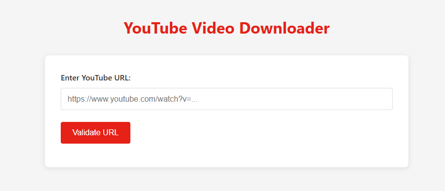

# YouTube Video Downloader

A simple web application that allows users to download YouTube videos by providing a URL and selecting a quality option.



## Features

- YouTube URL validation
- Video quality selection (1080p, 720p, 480p, and audio-only options)
- Video thumbnail preview 
- Download progress tracking
- Direct download of videos to your device
- Clean, responsive UI

## Demo

[Live Demo](https://github.com/yourusername/youtube-downloader) - Replace with your GitHub Pages or hosting URL if available

## Requirements

- Node.js (v12 or higher)
- npm (v6 or higher)

## Installation

1. Clone this repository
```bash
git clone https://github.com/yourusername/youtube-downloader.git
cd youtube-downloader
```

2. Install dependencies
```bash
npm install
```

## Usage

1. Start the application:

```bash
npm start
```

For development with automatic reloading:
```bash
npm run dev
```

2. Open your browser and navigate to `http://localhost:5000`

3. Enter a valid YouTube URL in the input field and click "Validate URL"

4. Once validated, you'll see the video thumbnail and available quality options

5. Select your preferred video quality from the dropdown menu

6. Click "Download Video" to start the download

## How It Works

The application uses:
- Express.js for the backend server
- Node.js for handling requests
- ytdl-core for YouTube video processing
- Vanilla JavaScript for the frontend

When a user inputs a YouTube URL, the application:
1. Validates the URL format
2. Fetches video metadata and thumbnail
3. Presents quality options
4. Streams the video directly to the user's browser when they click download

## Technologies Used

- **Backend**: Node.js, Express
- **Frontend**: HTML, CSS, JavaScript
- **YouTube API**: @distube/ytdl-core
- **Development**: Nodemon for hot reloading

## Screenshots


(Note: Replace with actual screenshots from your application)

## Contributing

Contributions are welcome! Please feel free to submit a Pull Request.

1. Fork the repository
2. Create your feature branch (`git checkout -b feature/amazing-feature`)
3. Commit your changes (`git commit -m 'Add some amazing feature'`)
4. Push to the branch (`git push origin feature/amazing-feature`)
5. Open a Pull Request

## License

This project is licensed under the MIT License - see the [LICENSE](LICENSE) file for details.

## Legal Disclaimer

This application is for personal and educational use only. The downloading of copyrighted content might be against YouTube's Terms of Service. The developers of this application are not responsible for any misuse of this tool. 

## Contact

Your Name - [@your_twitter](https://twitter.com/your_twitter) - email@example.com

Project Link: [https://github.com/yourusername/youtube-downloader](https://github.com/yourusername/youtube-downloader) 